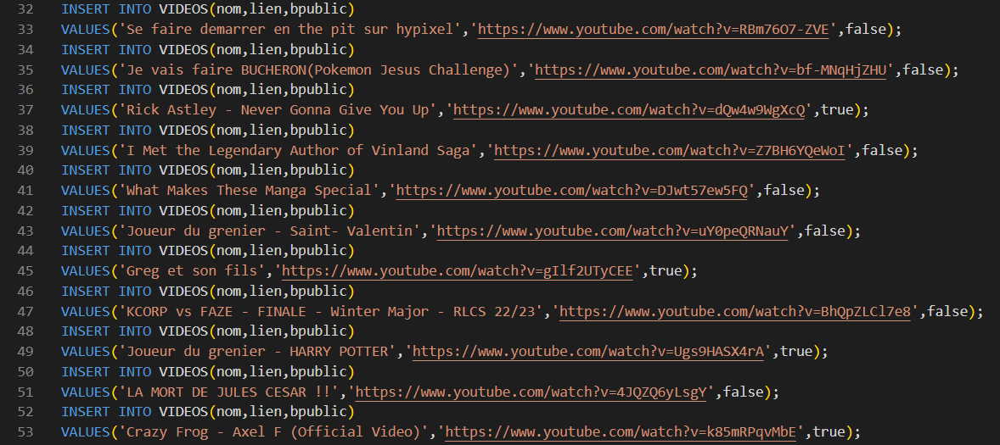

## Projet "Momentos"

### Création du projet

L'objectif de la SAE est de créer un service et de l'héberger sur un Docker. Pour cela, nous avons choisi d'imaginer et de construire un site style "Drive" permettant le stockage privé ou public de liens vidéos youtube.

### Technique utilisée

Afin de créer ce projet, nous avons principalement utilisé de l'HTML/CSS, une base de données MYSQL et du code PHP pour récupérer les différentes informations de cette base de données.

Afin d'accélérer la création du site, nous avons utilisé le framework "Tailwindcss", facilitant la création du CSS par des "mini-classes".

### Fonctionnement du site

En entrant sur le site, nous sommes confrontés à un formulaire de connexion, il est essentiel pour pouvoir accéder aux liens privés de nos utilisateurs. Pour le bien de ce projet, nous avons pré-créé 3 utilisateurs:

- IDENTIFIANT: momo, MOT DE PASSE: password
- IDENTIFIANT: martin, MOT DE PASSE: queque
- IDENTIFIANT: axel, MOT DE PASSE: html

Chaque utilisateur possède différents liens vidéos privés et publics, pré-définis dans la base de données:

Une fois sur le site, on a accès à deux onglets: **Espace personnel** et **Espace public**,

- L'espace personnel contient toutes les vidéos privées et publiques de l'utilisateur actuel, avec leur nom et leur miniature associée.
- L'espace public contient toutes les vidéos publiques de tous les utilisateurs, comme une sorte de page d'accueil de Youtube.

L'utilisateur peut donc cliquer sur une vidéo et être redirigé sur la vidéo Youtube !

## Version "Docker-compose"

Nous avions initialement réalisé l'application avec docker-compose afin de lier une base de données MySQL en ligne à notre site (afin de ne pas la réinitialiser à chaque démarrage) cependant après consultation avec Mr Colin, l'utilisation du docker-compose n'était pas autorisé mais que l'on pouvait fournir un version pour réaliser notre idée initiale.

L'idée de Docker-compose est d'avoir plusieurs services/conteneurs et les démarrer simultanément. Celui-ci contient PHP-Apache, MySQL et PHPMyAdmin: 3 différents services avec leur propre conteneur et port. Nous pouvons ensuite avec une seule commande créer et démarrer tous les services `.yaml` du docker-compose.

### Lancement du docker-compose
Nous avons donc une base de données MySQL et une interface PHPMyAdmin afin d'intéragir avec notre base de données. Nous pouvons accéder à cette interface en se rendant à l'adresse `localhost:8080`.

Lorsque vous lancez le docker-compose avec `docker-compose up`, la base de données va être créée et vous devez ajouter des données avec l'interface PHPMyAdmin. Pour accéder à notre site et les vidéos sur ce site, nous devons projeter le port où se situe le site (9000) avec Ngrok (API permettant de projeter des ports afin de l'heberger temporairement).

